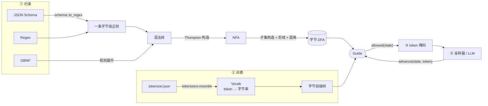
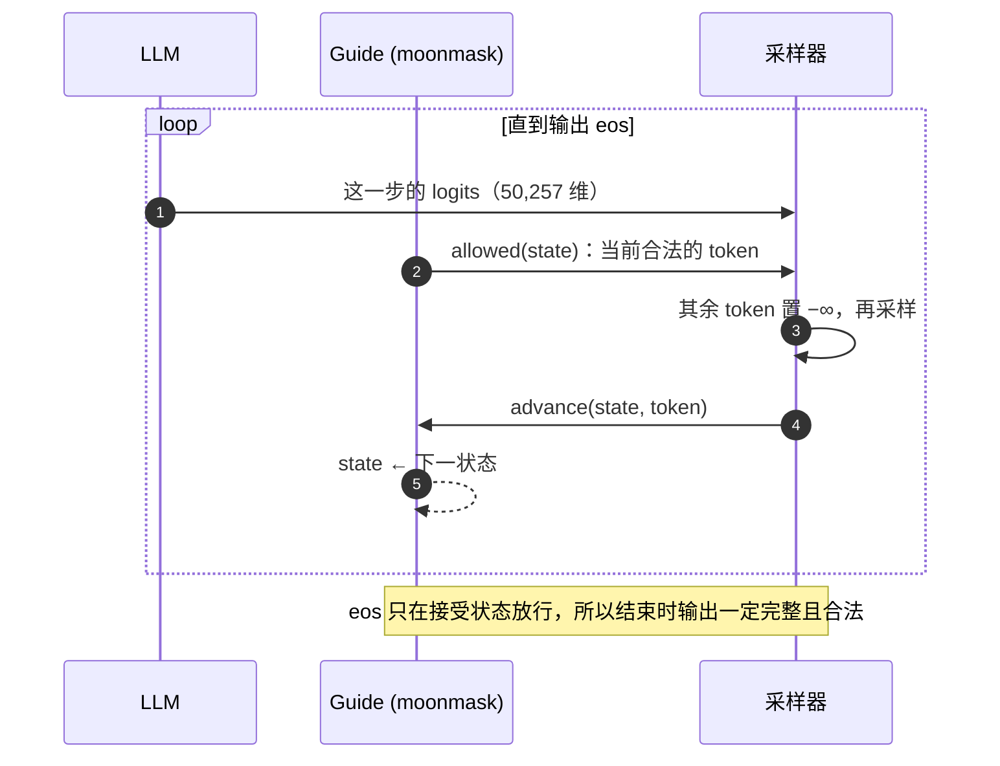

<div align="center">

# ◐ moonmask

**MoonBit 原生的大模型结构化输出约束引擎**

把 JSON Schema / 正则 / GBNF 编译成字节级 DFA，在每一步采样前算出“还能接上”的 token，<br>
让模型的输出**从构造上**就是合法的，而不是生成完再校验、失败再重试。

[](https://github.com/FidollarinLA/moonmask/actions/workflows/ci.yml)
[](https://fidollarinla.github.io/moonmask/)
[](https://www.moonbitlang.com)
[](LICENSE)

[在线 Playground](https://fidollarinla.github.io/moonmask/) · [快速开始](#快速开始) · [工作原理](#工作原理) · [实验结果](#实验结果) · [文档](#文档)

<a href="https://fidollarinla.github.io/moonmask/"></a>

<sub>上图是浏览器里的 Playground：左边写约束，右边看解码器一个 token 一个 token 地生成，下方是当前状态的掩码、自动机和随机采样实验。整个页面由 MoonBit 编译成 JavaScript。</sub>

</div>

---

English: a constrained decoder for LLMs, written in MoonBit. It compiles JSON Schema, regex or GBNF to a byte-level DFA and masks every token that cannot lead to a valid output. [Try it in the browser](https://fidollarinla.github.io/moonmask/).

## 一眼看懂

| | 不加约束 | 用 moonmask |
| --- | --- | --- |
| 做法 | 让模型自由生成，结束后做 JSON 校验，不合法就重试 | 每一步只允许“接上之后仍可能合法”的 token，其余 logit 置为 −∞ |
| 合法率 | 取决于模型；随机采样时 **0 / 100** | 由算法保证；随机采样时 **100 / 100** |
| 成本 | 重试浪费 token 和时间 | 每个 DFA 状态的掩码算一次后缓存 |
| 适用 | 任何 API | 能拿到每一步 logits 的推理（进程内或本地推理服务） |

一句话：**moonmask 负责告诉采样器“这一步哪些 token 能选”，模型只在合法的范围内做选择。**

## 工作原理



1. **约束 → DFA。** 三种约束都先变成同一种语法树，再经 Thompson NFA、子集构造得到按字节转移的 DFA。到不了接受状态的状态被剪掉，所以“走到死状态”在任何时候都能立刻发现；每个状态还记下离接受状态最少还差几个字节。
2. **词表 → 前缀树。** 用 [tokenizers-moonbit](https://mooncakes.io/docs/howtomakeaname/tokenizers-moonbit) 读取 GPT-2 的 `tokenizer.json`，把 50,257 个 token 还原成字节串并建成前缀树。
3. **DFA × 前缀树 → 掩码。** 从当前状态出发沿前缀树走，相同前缀只走一次，走不通就剪掉整棵子树。结果按状态缓存。
4. **解码循环。** 采样器只在掩码内选 token，然后用 `advance` 推进状态，直到在接受状态选出 eos。

每一步发生的事情：



下图是 Playground 里的自动机视图。解码器刚输出了 `"}` 和 `top_k` 两个 token（虚线轨迹），停在状态 413；右边是接下来能走的状态和对应的字节类，`d` 是离合法结尾还差的字节数：

<p align="center"></p>

## 实验结果

**猴子打字机**：不用任何模型，每一步从词表里均匀随机选 token。加掩码的一组只能在合法 token 里选；对照组直接在全部 50,257 个 token 里选。两组输出都交给独立的校验器 [moonschema](https://mooncakes.io/docs/moonbitstack/moonschema) 判定。固定种子 `moonmask-monkey-typewriter-00042`，每个 schema 各采样 100 次，GPT-2 词表：

| schema | 加掩码 | 不加掩码 | 平均 token 数 | DFA 状态数 |
| --- | --- | --- | --- | --- |
| [`user.json`](examples/schemas/user.json) | `██████████` **100/100** | `··········` 0/100 | 36.79 | 500 |
| [`order.json`](examples/schemas/order.json) | `██████████` **100/100** | `··········` 0/100 | 68.29 | 1,401 |
| [`tool_call.json`](examples/schemas/tool_call.json) | `██████████` **100/100** | `··········` 0/100 | 34.70 | 1,016 |

随机选 token 是最差的“模型”：它完全不懂 JSON。即便如此，加上掩码后 300 次全部合法。真实模型本来就倾向于合法输出，掩码只是把它偶尔的错误堵死。

复现（完整运行约 2 秒）：

```bash
./scripts/fetch-gpt2.sh     # 按固定版本下载 GPT-2 tokenizer.json 并校验 SHA-256
moon run cmd/main --target native -- assets/gpt2/tokenizer.json \
  examples/schemas/user.json examples/schemas/order.json examples/schemas/tool_call.json
```

## 快速开始

moonmask 还没有发布到 mooncakes。可以克隆仓库，在自己的项目里用 `moon.work` 引用源码：

```bash
git clone https://github.com/FidollarinLA/moonmask.git
./moonmask/scripts/fetch-gpt2.sh
```

在推理循环里接入：

```moonbit
let tok = @tokenizer.from_file("assets/gpt2/tokenizer.json")
let vocab = @vocab.from_tokenizer(tok, eos_token="<|endoftext|>")
let guide = @mask.Guide::new(@schema.compile(schema), vocab)
let mut state = guide.start()
// 每一步：只保留 guide.allowed(state)，其余 logit 置为 -inf，采样得到 token，然后：
match guide.advance(state, token) {
  Some(next) => state = next
  None => () // eos：输出已经完整且合法
}
```

正则和 GBNF 换一个编译入口即可：`@regex.compile("20[0-9]{2}-[01][0-9]")`、`@gbnf.compile(grammar)`，得到的都是同一种 `Dfa`。

## 支持什么

| 约束 | 支持 | 详细规格 |
| --- | --- | --- |
| **JSON Schema** | `string`（长度、`pattern`、UTF-8、转义）、`integer` / `number`（范围）、`boolean`、`null`、`enum`、`const`、`object`（`required` 之外的属性可省略）、`array`、`anyOf`、`$defs` / `$ref` | [docs/schema-subset.md](docs/schema-subset.md) |
| **Regex** | 字面量、字符类、分组、选择、`* + ? {n,m}`，按字节匹配 | [regex/](regex) |
| **GBNF** | 多条规则互相引用、字符类、量词、注释；不支持递归 | [docs/gbnf.md](docs/gbnf.md) |
| **词表** | GPT-2 字节级 BPE（`tokenizer.json`） | [vocab/](vocab) |

写不进子集的关键字**直接报错**，不会被静默忽略，所以自动机的含义和你写的约束始终一致。

## 项目结构

```text
moonmask/
├── regex/        正则解析 → Thompson NFA → 子集构造 DFA（剪枝、距离、采样）
├── schema/       JSON Schema 子集 → 字节级正则
├── gbnf/         GBNF 文法 → 同一种 DFA
├── vocab/        GPT-2 tokenizer.json → token 字节串（基于 tokenizers-moonbit）
├── mask/         Guide：前缀树 + 每状态掩码缓存；monkey / monkey_step 采样器
├── cmd/main/     猴子打字机实验 CLI（native 后端）
├── playground/   浏览器 Playground（MoonBit + rabbita，独立模块，不进发布包）
├── examples/     实验用的三个 schema
├── docs/         规格细则、设计说明、截图
└── scripts/      fetch-gpt2.sh：下载并校验 GPT-2 词表
```

## Playground

[fidollarinla.github.io/moonmask](https://fidollarinla.github.io/moonmask/) 上的页面是 [`playground/`](playground) 编译出来的，用 [rabbita](https://github.com/moonbit-community/rabbita) 写成，除了一行 `performance.now()` 以外没有手写 JavaScript。可以：

- 在 JSON Schema / 正则 / GBNF 之间切换，边改边重新编译，看 DFA 状态数和 schema 生成的正则；
- 播放或单步解码，对比加掩码和不加掩码：不加掩码时通常第一个 token 就掉进死状态；
- 看当前状态有多少 token 合法，点击某个 token 自己充当模型；
- 看自动机的局部结构和刚走过的轨迹；
- 一键跑 30 + 30 次随机采样实验；
- 把玩具词表换成真实的 GPT-2 词表（浏览器里下载并解析 50,257 个 token）。

## 文档

- [docs/schema-subset.md](docs/schema-subset.md)：支持的 JSON Schema 关键字和边界情况
- [docs/gbnf.md](docs/gbnf.md)：GBNF 子集
- [docs/design.md](docs/design.md)：算法细节、终止性、测试方法
- [CHANGELOG.md](CHANGELOG.md)

## 测试

```bash
moon test --deny-warn
```

正则与 `moonbitlang/regexp` 做了 9000 次以上差分对照；schema 自动机随机生成的字符串全部交给 moonschema 校验；有限语言上掩码与穷举结果一致；前缀树与逐个扫描词表结果一致；GBNF 采样结果全部被同一文法的解释器接受。CI 覆盖 Ubuntu、macOS、Windows 以及 native 后端。详见 [docs/design.md](docs/design.md#测试)。

## 限制

- 推理时每一步都要能拿到 logits。只返回整段文本的云端 API 只能事后校验。
- 只生成紧凑 JSON（不含空白），object 属性按声明顺序输出。
- 不支持递归结构：递归 schema、递归 GBNF 规则都会报错。
- 词表只支持 GPT-2 字节级 BPE；SentencePiece 会在加载时拒绝。

## 参考与许可证

方法参考 Outlines（Willard & Louf, 2023，Apache-2.0）、XGrammar（Apache-2.0）和 llguidance（MIT），不复制它们的代码。Playground 的 token 色块参考了 [tiktokenizer](https://github.com/dqbd/tiktokenizer) 的样式，同样是重新实现。GPT-2 分词器文件为 MIT，由 `scripts/fetch-gpt2.sh` 下载，不放进仓库，也不进入发布包。

本项目使用 [Apache-2.0](LICENSE)。
