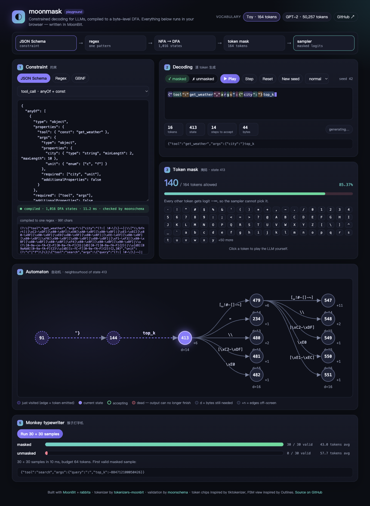

# moonmask playground

A single-page app that runs moonmask in the browser. It is written in MoonBit
with [rabbita](https://github.com/moonbit-community/rabbita) and compiled to
JavaScript. The core interactive decoder is MoonBit. A separate historical-trace
page uses a small JavaScript renderer; it never performs model inference or decoding.

Live: <https://fidollarinla.github.io/moonmask/>



## Panels

1. **Constraint**: JSON Schema, regex or GBNF, with presets. Recompiles as you
   type and shows the DFA size, compile time and, for schemas, the generated regex.
2. **Decoding**: a sampler picks tokens one at a time. With the mask on it can only
   pick legal tokens; with the mask off it draws from the whole vocabulary and
   usually breaks the output on the first token.
3. **Token mask**: how many tokens are legal in the current state. Click one to
   play the LLM yourself.
4. **Automaton**: the last two moves (edges labelled with the emitted token), the
   current state, and two layers of reachable states with byte-class edges.
5. **Monkey typewriter**: 30 masked and 30 unmasked random samples, all checked by
   the same validator (moonschema for schemas, the DFA otherwise).

Schema mode starts with **Compact JSON**. **Allow JSON whitespace** accepts SP,
TAB, CR and LF at structural boundaries and document edges. Switching policy
recompiles, pauses playback, clears the current run and benchmark, and preserves
the seed. Regex and GBNF are unaffected. This is uniform random sampling, not a
live language model or a model-quality benchmark.

The default vocabulary is a 166-token toy set (including TAB and CR). "GPT-2" downloads the real
50,257-token `tokenizer.json` from Hugging Face (pinned revision) and parses it
with tokenizers-moonbit in the browser.

## Build

```bash
cd playground
python build.py            # Windows / macOS / Linux, Python 3.12 + MoonBit
python3 -m http.server -d dist 8000
```

Test only the app package (the workspace also includes the parent library):

```bash
moon test --target js -p FidollarinLA/moonmask-playground/app
```

`moon.work` points at the parent directory, so the playground always builds
against the moonmask sources next to it rather than a published version.

## Recorded real-model traces

Open `dist/traces.html` after building (also linked from the Playground header).
The standalone page displays the existing DistilGPT-2 corpus: choose task, pure
or completion policy, and compact/whitespace/unmasked mode; inspect every token,
score, rank and DFA state using the slider or previous/next buttons. Schema,
EOS and full-answer matching are separate indicators. It preserves the Tokyo→Paris
and reversed-array failures and does not repair output. It is historical evidence,
not a live model, online model service or accuracy benchmark.

`build.py` verifies all canonical evidence hashes and checks that prompt, schema
and expected-answer scores match the corpus before producing the page. It embeds
only the checked-in public fixtures and needs no PyTorch or model download.
Dynamic content is displayed as text, not HTML. To check the publication guards:

```bash
python -m unittest discover -s playground -p test_build.py -v
```

## Credits

Token chips follow the look of [tiktokenizer](https://github.com/dqbd/tiktokenizer);
the automaton view is inspired by the FSM diagrams in
[Outlines](https://github.com/dottxt-ai/outlines). Both were re-implemented from
scratch in MoonBit; no code was copied.
